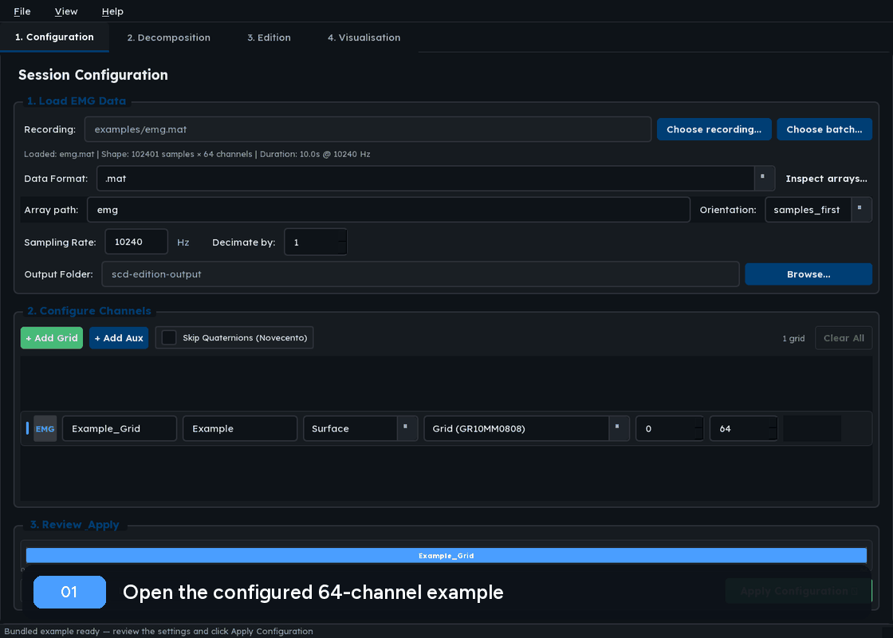

# SCD Edition

[](https://www.python.org/downloads/)
[](LICENSE)

A graphical application for researchers and engineers to decompose high-density surface or intramuscular EMG recordings into individual motor unit spike trains, edit them manually, and visualise population-level discharge behaviour.

Supports OT Bioelettronica `.otb+`/`.otb4`, Intan `.rhs`, MATLAB, HDF5,
NumPy and CSV recordings on Windows, Linux and macOS.



Built on the [Swarm Contrastive Decomposition (SCD)](https://github.com/AgneGris/swarm-contrastive-decomposition) algorithm.
The desktop interface uses the official [Qt for Python (PySide6)](https://doc.qt.io/qtforpython-6/) bindings.

---

## Table of Contents

1. [Installation](#installation)
2. [Two-minute example](#two-minute-example)
3. [Choosing a tool](#choosing-a-tool)
4. [Launching the app](#launching-the-app)
5. [Complete workflow](#complete-workflow)
   - [Tab 1 — Configuration](#tab-1--configuration)
   - [Tab 2 — Decomposition](#tab-2--decomposition)
   - [Tab 3 — Edition](#tab-3--edition)
   - [Tab 4 — Visualisation](#tab-4--visualisation)
6. [Saving and loading](#saving-and-loading)
7. [Keyboard shortcuts](#keyboard-shortcuts)
8. [File formats](#file-formats)
9. [Importing an unfamiliar format](#importing-an-unfamiliar-format)
10. [Force channel setup](#force-channel-setup)
11. [Citation](#citation)
12. [Contributing](#contributing)
13. [License](#license)

---

## Installation

### From PyPI (recommended)

```bash
pip install scd-edition
```

Windows users who do not want to manage Python can instead download the
`windows-x86_64.zip` archive from the latest GitHub Release, extract it and run
`SCD-Edition.exe`. This standalone build is CPU-only; use a source installation
with the `cuda` extra for NVIDIA GPU acceleration.

### Latest development version

```bash
pip install git+https://github.com/AgneGris/scd-edition.git
```

All dependencies install automatically.

On Windows, this route may install a CPU-only PyTorch build. Use the CUDA-enabled uv route below to ensure NVIDIA GPU support.

### From source with uv (recommended for development)

[uv](https://github.com/astral-sh/uv) manages the virtual environment and dependencies automatically.

Clone the repository, then choose the command for your platform:

```bash
git clone https://github.com/AgneGris/scd-edition
cd scd-edition
```

On Windows, install and require a uv-managed Python to avoid DLL conflicts with Conda or Anaconda:

```powershell
uv python install 3.13
```

**Windows — CUDA-enabled (recommended if you have an NVIDIA GPU):**
```bash
uv sync --python 3.13 --managed-python --extra cuda
.venv\Scripts\Activate.ps1
```

**Linux — CUDA-enabled:**
```bash
sudo apt-get install libegl1 libxkbcommon-x11-0 libxcb-cursor0
uv sync --extra cuda
source .venv/bin/activate
```

**macOS or CPU-only Linux:**
```bash
uv sync --extra cpu
source .venv/bin/activate
```

On CPU-only Linux, install the same Qt runtime packages shown in the CUDA-enabled Linux example before launching the GUI. Package names may differ on distributions that do not use `apt`.

**CPU-only Windows:**
```bash
uv sync --python 3.13 --managed-python --extra cpu
.venv\Scripts\Activate.ps1
```

### From source with pip

```bash
git clone https://github.com/AgneGris/scd-edition
cd scd-edition
pip install -e .
```

## Two-minute example

SCD Edition includes the 64-channel, 10-second example recording used by the
SCD algorithm repository. Open it with its loader, sampling rate and electrode
layout already filled in:

```bash
scd-edition --example
```

Then:

1. Click **Apply Configuration**.
2. Click **Start Decomposition** and confirm the automatically selected channels.
3. Select **Full file**, or choose a short time interval for a faster first run.
4. Review the resulting units in **Edition** and **Visualisation**.

The example is for learning the workflow, not for benchmarking decomposition
accuracy. See the [illustrated quick-start](docs/quickstart.md) or the executable
[tutorial notebook](docs/tutorial.ipynb) for more detail.

## Choosing a tool

SCD Edition is one of several strong tools for motor-unit decomposition. The
right choice depends on the algorithm, acquisition system and analysis workflow;
this table describes scope rather than ranking performance.

| Tool | Decomposition and scope | Environment and access | Particularly useful when |
|---|---|---|---|
| **SCD Edition** | Swarm Contrastive Decomposition; surface and intramuscular EMG; integrated review, spike editing and population plots | Open-source BSD Python/Qt app; PyPI and a standalone Windows release | You want the SCD method and a reproducible path from raw recording to edited units |
| [DEMUSE](https://demuse.feri.um.si/) | CKC decomposition, accuracy assessment and manual editing for multichannel surface EMG | Commercially available MATLAB program | You want the established CKC/DEMUSE workflow |
| [OTBioLab+](https://otbioelettronica.it/en/software/) | Manufacturer acquisition and processing suite with motor-unit decomposition | Vendor-distributed desktop software | You acquire with OT Bioelettronica hardware and want its native workflow |
| [openhdemg](https://github.com/GiacomoValliPhD/openhdemg) | Convolutive BSS plus broad import, analysis, tracking and editing functionality for HD-sEMG | Open-source BSD Python framework with graphical software | You need a broad motor-unit analysis library or interoperability with several decomposition formats |
| [MUedit](https://github.com/simonavrillon/MUedit) | fastICA decomposition and manual pulse-train editing | Open-source MATLAB app;  | You want the published MUedit protocol and its fastICA workflow |

Algorithm outputs should be reviewed using physiological criteria and validation
appropriate to the study; this table is not evidence that the tools are
interchangeable.

## Usage 🚀

## Launching the app

```bash
scd-edition
```

Or, if the entry point is not on your PATH:

```bash
python -m scd_app
```

The application opens with four tabs along the top. Work left to right: configure → decompose → edit → visualise.

You can also skip the first two tabs entirely: decompose with the [`swarm-contrastive-decomposition`](https://github.com/AgneGris/swarm-contrastive-decomposition) package in a script and open its output here — see [Decomposing with the SCD package, editing here](#decomposing-with-the-scd-package-editing-here).

---

## Decomposing with the SCD package, editing here

The Decomposition tab runs the same algorithm as the [`swarm-contrastive-decomposition`](https://github.com/AgneGris/swarm-contrastive-decomposition) Python package, so you can decompose in a script or on a cluster and use this app only for editing. Save the results with the package's `save_results`, then load the `.pkl` with **Load Decomposition** in the Edition tab:

```python
import scd

dictionary, timestamps = scd.train("recording.mat", config_name="surface")
scd.save_results("recording_surface.pkl", dictionary)
```

Since version 0.2.3 the package stores the loaded signal in the results by default (`save_data`), together with the trimming window and rejected channels it decomposed with. With that in the file, the Edition tab has everything an in-app decomposition would have: full-length sources, MUAP display, filter recalculation and spike re-detection. Note that the stored signal makes the file larger by `channels × samples × 4 bytes`; the package README explains how to turn it off.

What differs from an in-app decomposition:

- The file holds one grid, named after the `muscle-<name>` part of the filename, or the filename itself.
- No electrode geometry is recorded, so MUAPs are shown in the default grid layout, and there are no force or auxiliary channels.
- Files written with `save_data=False`, or by package versions before 0.2.3, open without the signal: spike trains and sources can still be edited and saved, but MUAPs, filter recalculation and re-detection are unavailable.

### The silhouette (SIL) is not the same number in the two tools

The package accepts sources using a silhouette it computes during decomposition; this app computes its own SIL for the Quality chart and the reliability flag. They are different quantities and should not be compared or thresholded interchangeably. This also applies to decompositions run in the Decomposition tab, whose *SIL Threshold* is the package's acceptance silhouette.

| | `swarm-contrastive-decomposition` (`dictionary["silhouettes"]`) | SCD Edition (MU properties, Quality chart) |
|---|---|---|
| When | During decomposition, at the iteration that accepted the unit; frozen in the output | After loading and after every edit, from the unit's current spikes |
| Source | The source of that iteration: computed from the peeled EMG (earlier units removed), restricted to the decomposition window, edge-masked, clamped, squared | The full-length source recomputed on load (spike-triggered-average filter on the whole recording, z-scored on the decomposition window), squared; not clamped or edge-masked |
| Points | Every peak of the squared source at least `reset_peak_separation_ms` apart — spikes *and* baseline peaks | Spikes: the unit's current timestamps. Baseline: every peak lower than the smallest spike |
| Classes | Two-class k-medians on peak heights; spikes are the upper cluster | No clustering — the spike set is whatever the unit currently has |
| Score | For each peak, `a` = distance to its own centroid, `b` = distance to the other centroid; SIL = mean over all peaks of `(b − a) / max(a, b)` | Only spike amplitudes enter: `d_s = Σ (s − mean_spikes)²`, `d_b = Σ (s − mean_baseline)²`; SIL = `(d_b − d_s) / max(d_b, d_s)` (`motor_unit_toolbox.get_silhouette_measure`, the formulation of Negro et al., 2016). Squared distances, summed; the baseline enters only through its mean |
| Threshold | `acceptance_silhouette` (0.85 default, 0.8 in the `surface` preset) decides whether a source is accepted | SIL ≥ 0.9 marks a unit as reliable |

In practice the two values are often close for well-separated units, but they diverge when the baseline peaks are numerous or spread out (the package averages over them, the toolbox ignores their spread), when a unit has been edited (only this app's value follows the edits), and whenever the two sources differ (window vs full recording, peeled vs recomputed filter). The package's values are kept in the file under `scd_metadata["silhouettes"]` for reference but are not displayed.

---

## Complete workflow

### Tab 1 — Configuration

This tab is where you tell the application about your recording before doing anything else.

#### 1. Select your input file

Click **Choose recording…** and select your EMG recording. Supported formats:

| Extension | Format |
|-----------|--------|
| `.otb+`   | OTBiolab+ (Quattrocento amplifier) |
| `.otb4`   | OTBiolab 4 (Novecento+ amplifier) |
| `.rhs`    | Intan RHS2000 (Stim/Recording Controller) |
| `.mat`    | MATLAB |
| `.h5`     | HDF5 |
| `.npy`    | NumPy array |
| `.csv`    | Comma-separated values |

Use **Choose batch…** to select multiple recordings that share one format and
channel layout. They will be decomposed sequentially with the same
configuration.

If a MATLAB, HDF5, NumPy, CSV, or text file does not match the selected format,
the array inspector opens automatically. You can also reopen it with the
advanced **Inspect arrays…** action beside **Data Format**. It lists numeric
arrays, lets you choose the EMG matrix and orientation, and previews the
resulting sample/channel shape. See
[Importing recordings without a built-in loader](docs/importing-data.md).

#### 2. Set the sampling rate

Enter the sampling rate of your recording in Hz (e.g. `2048` for a Quattrocento at 2 kHz). For formats that carry it in the file (`.otb4`, `.rhs`) it is filled in automatically.

**Decimate by** (next to the sampling rate) reduces the rate the decomposition works at by an integer factor, for any file format. The loader low-pass filters (zero-phase FIR) before subsampling, so nothing aliases, and the delivered rate is shown beside the box. Use it for recordings sampled far above the amplifier bandwidth — e.g. a 20 kHz Intan file band-limited at 500 Hz decimated by 5 to 4 kHz — so that extension factors and MUAP windows stay meaningful in milliseconds and runtime drops accordingly. Loader presets can seed the box (`decimate:` in the loader YAML); the value is saved with the configuration. The factor must divide the sampling rate exactly.

#### 3. Add electrode grids

Click **+ Add Grid** for each electrode array in your recording. For each grid, specify:

- **Name** — a label you choose (e.g. `Biceps`, `FDI`)
- **Muscle** — optional, for your own reference
- **Type** — Surface or Intramuscular
- **Electrode model** — select from the dropdown (e.g. `GR10MM0808` for a 64-channel 8×8 surface grid)
- **Channel start / end** — which channels in the file correspond to this grid (0-indexed, end is exclusive). The colour bar at the top shows how channels are allocated across all grids.

#### 4. Add force / auxiliary channels (optional)

If your recording includes force or other analogue channels, click **+ Add Aux Channel** for each one. Specify:

- **Name** — e.g. `Middle Ext`
- **Unit label** — e.g. `Middle Ext` (used to auto-select the correct channel when visualising named tasks)
- **Source** — `Signal` if force is stored as regular channels in the EMG array; `Auxiliary stream` for OTB+ `.sip` or Novecento+ external/AUX tracks
- **Channel start / end** — channel indices within the file (or sip stream)
- **MVC (mV)** — the maximum voluntary contraction value **in millivolts**. This is used to normalise force to %MVC in the visualisation. See [Force channel setup](#force-channel-setup) for how to find this value.

#### 5. Save / load your configuration

Click **Save Config** to export the full configuration (file path, grids, aux channels, parameters) to a JSON file. Click **Load Config** to restore a previously saved configuration. The input file is not overwritten when loading a config — the file you selected in step 1 is preserved.

#### 6. Apply

Click **Apply Configuration**. This validates all settings and prepares the decomposition tab. If anything is wrong (e.g. channel indices out of range) an error will appear here.

---

### Tab 2 — Decomposition

#### Global parameters

These apply to all grids:

| Parameter | What it does |
|-----------|--------------|
| **SIL Threshold** | Minimum silhouette score for a source to be accepted as a motor unit. Higher = stricter (fewer but more reliable MUs). Default 0.9. This is the decomposition algorithm's own silhouette, computed differently from the SIL shown in the Quality chart — see [The silhouette is not the same number in the two tools](#the-silhouette-sil-is-not-the-same-number-in-the-two-tools). |
| **Iterations** | Maximum number of optimisation steps per source. More iterations → longer runtime but potentially more MUs found. |
| **MUAP Window (ms)** | Duration of the spike-triggered average window used for peel-off. |
| **Fitness** | Optimisation criterion: `SIL` (silhouette) or `CoV` (coefficient of variation of ISI). |
| **Peel-off** | Whether to subtract each found motor unit from the signal before searching for the next. Recommended: on. |
| **Swarm mode** | Enables the particle swarm optimiser. Recommended: on. |
| **Adapt clamp** | Adaptive clamping during whitening. Recommended: on. |

#### Per-grid parameters

These can be set independently for each electrode grid by selecting the grid from the dropdown:

| Parameter | What it does |
|-----------|--------------|
| **SIL Threshold** | Per-grid SIL acceptance criterion (overrides global for this grid). |
| **Extension Factor** | Number of delayed copies of each channel used to extend the observation space. Larger values capture more motor unit information but increase computation time. Typical: 10–30 for surface, 20–40 for intramuscular. |
| **High-pass (Hz)** | High-pass filter cutoff. Use ≥10 Hz for surface, ≥20 Hz for intramuscular. |
| **Low-pass (Hz)** | Low-pass filter cutoff. 4400 Hz is typical for surface at 10 kHz; adjust to ~half the Nyquist of your sampling rate. |
| **Notch filter** | Remove power-line interference: `None`, `50 Hz` (Europe), or `60 Hz` (Americas). |
| **Notch harmonics** | Also remove harmonics (100, 150 Hz etc.) when notch is active. |

#### Batch processing options

When multiple files are queued:

- **Shared rejection** — perform channel rejection on the first file only, then apply the same rejection mask to all subsequent files. Useful when recording conditions are stable across files.
- **Per-file rejection** — perform channel rejection independently for each file.

#### Starting decomposition

1. Click **Start Decomposition**.
2. A signal plot appears. Noisy or broken channels are shown as dashed lines. **Click any channel to toggle rejection** (rejected channels are excluded from decomposition).
   - Scroll to zoom the time axis
   - Shift+Scroll to pan
   - Right-drag to pan
   - `R` to reset the view
3. Optionally set a **time window** (plateau) to decompose only a steady-state segment. Click on the plot to set start and end points, or enter times manually.
4. Click **Confirm** to start the actual decomposition. Progress and found sources are shown in real time.
5. Click **Stop** at any time to halt early. Results from completed grids are saved.

When decomposition finishes, the results are automatically saved to a `.pkl` file in the configured output folder, and the Edition tab opens.

---

### Tab 3 — Edition

This is the main editing environment. It shows one motor unit at a time.

#### Navigating between units

- Use the **Port** dropdown to switch between electrode grids.
- Use the **Unit** dropdown or the **Up/Down arrow keys** to switch between motor units within a port.
- The **properties panel** on the right updates automatically:
  - **Spike count, mean discharge rate, CoV ISI, minimum ISI**
  - **SIL and MUAP template stability** — complementary source-separation and
    waveform-consistency measures.
  - **Reliability badge** — a unit is automatically **RELIABLE** when every
    automatic criterion passes:
    SIL ≥ 0.9, CoV ISI ≤ 40 %, discharge rate 3–40 Hz and at least 10
    spikes. Hover the badge to see which criteria a unit fails.
    Left-click the badge (or press `T`) to override the verdict by hand — an
    overridden badge is italic and marked *(manual)*, and the unit is shown as
    `✓*` / `✗*` in the unit dropdown. Right-click (or press `Shift+T`) to go
    back to the automatic verdict. Manual verdicts are saved with the session.
  - **MUAP amplitude, waveform length, peak and median frequency**
  - **Duplicate warning** — if the current unit is very similar to another unit in the same port

MUAP template stability is the normalized correlation (0–1) between two
spike-triggered average templates made from alternating discharges. It is
calculated from the original multichannel EMG, so it is unavailable when raw
EMG is not embedded in the file or when fewer than five valid discharges are
available for either half. It is shown as a descriptive consistency measure,
not used as an automatic acceptance threshold.

PNR is intentionally not reported for SCD units. Although the conventional
30 dB boundary is familiar in the field, it was validated for CKC sources and
does not have the same interpretation for SCD's normalized source signals.

#### Source signal plot

The large plot on the left shows the squared source signal (the spatial filter output) with spike locations marked as orange circles. A shaded region shows the plateau used for decomposition; outside this region the signal is reconstructed by replaying the peel-off sequence over the full recording.

**Scrolling / zooming:**
- **Scroll** — zoom in/out along the time axis
- **Shift+Scroll** — scroll horizontally
- **Ctrl+Scroll** — zoom in/out in both axes
- `Home` — reset view to show the full signal

If force channels are configured, a force trace is overlaid on the source plot. The right y-axis shows % MVC, scaled automatically to the actual force range.

#### Editing modes

| Mode | How to activate | What it does |
|------|----------------|--------------|
| **View** | `V` or button | Navigate without editing. Quick-edit with `Ctrl+Click` (add) or `Alt+Click` (delete). |
| **Add** | `A` or button | Click near a peak to add a spike. Snaps to nearest local maximum. |
| **Delete** | `D` or button | Click near an existing spike to remove the closest one. |
| **Add in Selection** | `Ctrl+A` or button | Drag a box to add all peaks found within it. |
| **Delete in Selection** | `Ctrl+D` or button | Drag a box to remove all spikes within it. |

Every edit shows a **live preview**: before you commit, the candidate spike's waveform is overlaid on the spike-triggered average (MUAP) plot so you can judge whether it looks like the unit's template. Press **Enter** to confirm or **Escape** to cancel.

Press `Ctrl+Z` to undo (up to 100 steps) and `Ctrl+Y` to redo.

#### ROI (Region of Interest)

Press `R` to toggle a draggable region on the signal. Then:
- `Shift+A` — add spikes within the ROI
- `Shift+D` — delete spikes within the ROI

#### MUAP plot

Shows the spike-triggered average for every EMG channel. Toggle between **stacked** and **grid** layout (the grid layout reflects the physical electrode geometry). Click a channel to open a pop-out window with a larger view.

#### Quality actions

| Button | Shortcut | Effect |
|--------|----------|--------|
| **Recalculate Filter** | `F` | Re-estimates the spatial filter from your edited spike train, then re-computes the source signal and re-detects timestamps. Requires ≥2 spikes in the plateau region. |
| **Auto-edit** | — | Automatically removes obvious outlier spikes based on physiological firing rate limits. |
| **Remove outliers** | — | Removes spikes with very short or very long ISIs. |
| **Flag unit** | `X` | Marks the unit for deletion. Duplicates are auto-flagged. |
| **Flag within-port duplicates** | — | Compares all units in each port and flags the lower-quality unit of every pair whose rate of agreement is above threshold. A summary dialog reports the pairs found, their RoA scores and which units were flagged. |
| **Flag cross-port duplicates** | — | Same, across all ports, with the same summary dialog. |
| **Delete All Flagged MUs** | — | Permanently removes all flagged units from the session (cannot be undone). Afterwards the view jumps back to the first unit of the first port. |

#### Saving

`Ctrl+S` saves the current state to a `.pkl` file. The first save opens a dialog; subsequent saves to the same file happen silently. The saved file contains the edited spike trains, spatial filters, raw EMG, force data, and all metadata needed to reload and continue editing later.

---

### Tab 4 — Visualisation

This tab shows population-level summaries for all motor units in the loaded decomposition. It updates automatically whenever you switch to it or edit spikes in Tab 3.

The left panel lists all motor units by port. Click a unit to toggle it on/off. Use **All** / **None** to show or hide all units at once. The **Sort** dropdown reorders units by recruitment threshold, index, or mean discharge rate.

If force channels are configured, they appear as overlays on the time-domain plots. Click the legend (top-right of each plot) to toggle individual channels. The right y-axis shows % MVC, automatically scaled to the actual force range of the recording.

#### Sub-tabs

**Raster** — each row is one motor unit; vertical marks show individual spike times. Force is overlaid at the bottom, scaled to its actual %MVC range. The full force recording is shown even if only part of the signal was decomposed.

**IDR (Instantaneous Discharge Rate)** — smoothed discharge rate (pps) over time for each unit. Useful for checking that firing rates are physiologically plausible and that units track the force task.

**CST (Cumulative Spike Train)** — sum of all discharge rate traces. Approximates the neural drive to the muscle.

**Quality** — SIL and MUAP template-stability bar charts for all units. The SIL
chart shows the automatic reliability threshold (SIL ≥ 0.9); template
stability is descriptive and therefore has no threshold line. This SIL is
computed by the app from the unit's current spikes and is not the silhouette
the decomposition algorithm used to accept the source — see
[The silhouette is not the same number in the two tools](#the-silhouette-sil-is-not-the-same-number-in-the-two-tools).

**DR vs Force** — scatter plot of each motor unit's recruitment force (%MVC at first spike) against its mean discharge rate during the plateau. A regression line is drawn when three or more units are present. This plot requires at least one active force channel.

---

## Saving and loading

Decomposition results are stored as `.pkl` (Python pickle) files. Each file contains:

- Raw EMG data (all channels, full recording)
- Spike timestamps for every motor unit
- Spatial filters (original and edited)
- Force / auxiliary channel data (full recording)
- Channel layout, rejection mask, electrode geometry
- Peel-off sequence (for filter recalculation)
- Quality metrics

To **reload** a decomposition: in Tab 3, click **Load Decomposition** and select the `.pkl` file. The app automatically recognises both SCD Edition files and raw `*_scddict.pkl` output from `swarm-contrastive-decomposition`. Raw SCD output is converted into a one-grid Edition session; the muscle label in the filename is used as the grid name, and any companion `*_scdcommit.txt` is retained as provenance.

SCD Edition files that contain the original EMG can replay peel-off and recalculate filters. Raw `swarm-contrastive-decomposition` output contains it too when saved with the package's default `save_data=True` (version 0.2.3 or later), so it gets the same treatment; output saved without the signal remains editable and can be saved from Edition, but filter/MUAP recalculation is unavailable. See [Decomposing with the SCD package, editing here](#decomposing-with-the-scd-package-editing-here).

For compatible SCD Edition files, the app may ask whether to re-run peel-off replay on the full signal (recommended for the first load) or to use the stored timestamps as-is (faster; appropriate when reloading a previously edited file).

Saved Edition files can be reloaded in any order and remain fully editable.

---

## Keyboard shortcuts

Global shortcuts:

| Key | Action |
|-----|--------|
| `Ctrl+1` | Switch to Configuration tab |
| `Ctrl+2` | Switch to Decomposition tab |
| `Ctrl+3` | Switch to Edition tab |
| `Ctrl+4` | Switch to Visualisation tab |

Edition shortcuts (after a decomposition is loaded):

| Key | Action |
|-----|--------|
| `A` | Arm **Add in Selection**; drag a rectangle to add enclosed peaks |
| `D` | Arm **Del in Selection**; drag a rectangle to remove enclosed spikes |
| `Esc` | Disarm selection and return to normal view interaction |
| `F` | Replay peel-off and recalculate the current unit's filter, source and timestamps |
| `O` | Remove instantaneous-firing-rate outlier spikes from the current unit |
| `E` | Run rule-based auto-editing on the current unit |
| `X` | Toggle the deletion flag on the current unit |
| `T` | Toggle the reliability verdict of the current unit |
| `Shift+T` | Reset reliability to the automatic verdict |
| `Ctrl+Z` | Undo (`Cmd+Z` on macOS) |
| `Ctrl+Y` | Redo (`Cmd+Shift+Z` on macOS) |
| `Ctrl+S` | Save (`Cmd+S` on macOS) |
| `Up` / `Down` | Previous / next motor unit |
| `Ctrl+Up` / `Ctrl+Down` | Previous / next electrode grid or probe |
| `Left` / `Right` | Pan the source plot left / right |
| `Home` | Reset the source and firing-rate view |
| `Scroll` | Zoom time axis |
| `Shift+Scroll` | Pan horizontally |
| `Ctrl+Scroll` | Zoom both axes |

---

## File formats

### Input

| Format | Notes |
|--------|-------|
| `.otb+` | OTBiolab+ archive (Quattrocento). EMG channels and auxiliary `.sip` channels (force, angle) are both supported. |
| `.otb4` | OTBiolab 4 archive (Novecento+). EMG grids, external/AUX channels, sampling rate, and acquisition metadata are discovered from the embedded track metadata. |
| `.rhs` | Intan RHS2000 recording. Enabled amplifier channels (mV), board ADC inputs (V, as `aux`) and the sampling rate are read from the file header. Intan recordings are usually heavily oversampled relative to the amplifier bandwidth; use **Decimate by** (e.g. 5 for 20 kHz → 4 kHz with a 500 Hz band limit). |
| `.mat` | MATLAB v5 and v7.3 (HDF5-based). Nested arrays can be selected with **Inspect arrays…** using paths such as `recording.signal`. |
| `.h5`, `.hdf5` | HDF5. Numeric datasets can be selected with **Inspect arrays…**; portable SCD HDF5 files are recognised automatically. |
| `.npy` | NumPy array, shape `(channels, samples)` or `(samples, channels)` — the longer axis is assumed to be time. |
| `.csv`, `.txt` | Numeric samples × channels table. CSV accepts one header row; text is whitespace-delimited. |
| `.pkl` (Edition tab) | SCD Edition files, and raw output of the [`swarm-contrastive-decomposition`](https://github.com/AgneGris/swarm-contrastive-decomposition) package (`scd.save_results`), which is converted on load. |

## Importing an unfamiliar format

For an unfamiliar MATLAB, HDF5, NumPy, CSV, or text layout, select it with
**Choose recording…**. The inspector opens automatically when the selected
format cannot locate an EMG matrix; it can also be opened manually with
**Inspect arrays…**. Save the finished configuration as a reusable JSON profile.
For a proprietary acquisition format, decode it with the vendor SDK
and write a portable, sample-first `.scd.h5` file with
`scd_app.io.write_portable_recording`. The schema, conversion example, and
verification checklist are in the
[data-import guide](docs/importing-data.md). Loader profiles never execute
file-supplied Python code.

### Output

`.pkl` files are standard Python pickle files. They can be opened in Python with:

```python
import pickle

with open("my_decomp.pkl", "rb") as f:
    data = pickle.load(f)

# Key fields:
data["ports"]  # list of port names (one per electrode grid)
data["discharge_times"]  # list[list[np.ndarray]] — spike timestamps in samples
data["sampling_rate"]  # int — sampling frequency in Hz
data["data"]  # np.ndarray — raw EMG, shape (channels, samples)
data["aux_channels"]  # list of dicts — force/aux data and metadata
```

---

## Force channel setup

Force channels allow you to overlay the force trace on source signal and discharge rate plots, and to normalise force to %MVC.

### Step 1 — Find the MVC value

The MVC value you enter must be in the **same units as the force signal stored in the file**.

**For OTBiolab+ recordings (.otb+):**
The Quattrocento ADC stores force channels internally in **millivolts (mV)** after its analogue-to-digital conversion. OTBiolab+ displays force in **Volts** on screen (e.g. "MVC = 0.049 V"). To get the correct value for the config:

```
MVC in mV = OTBiolab+ displayed value × 1000
```

Example: if OTBiolab+ shows `MVC = 0.049 V` for Middle Extension → enter `49` in the config.

You can find the displayed MVC value by opening the `.otb+` file in OTBiolab+ and reading the scale shown next to the force channel.

**For Intan recordings (.rhs):** board ADC inputs are converted to Volts
(312.5 µV/bit); enter MVC in Volts.

**For Novecento+ recordings (.otb4):** external/AUX channels are converted
using their per-track ADC metadata and retain the unit declared in the file
(the supplied Novecento+ examples declare Volts). Enter MVC in that same unit.

**For other formats:** use whatever MVC value is in the same units as the raw signal values in your file. You can check what the signal amplitude looks like by loading a decomposition and reading the console output — when data loads, the application prints the force channel min, max, and net amplitude so you can verify the units.

### Step 2 — Add the channel in the config

In Tab 1, click **+ Add Aux Channel** and fill in:

- **Name** — descriptive label (e.g. `Middle Ext`)
- **Unit label** — must match exactly if you want auto-selection by filename (e.g. `Middle Ext` will be auto-enabled for files with `mvc-15ext_fing-M` in the name)
- **Source** — `Signal` (channel embedded in the EMG array) or `Auxiliary stream` (OTB+ `.sip` or Novecento+ external/AUX track)
- **Channel start / end** — 0-based index of the force channel
- **MVC (mV)** — value from Step 1

### Step 3 — Verify

After running decomposition, switch to Tab 4 and open the **DR vs Force** sub-tab. The right y-axis should show percentages consistent with the task (e.g. 0–20% for a 15% MVC contraction). If the values look wrong (e.g. showing 10,000%), check that the MVC value is in mV, not in Volts.

---

## Under development

- **Multi-file comparison** — loading two decompositions side by side for the same recording
- **Calibrated quality control** — SCD-specific acceptance thresholds validated
  against independent reference decompositions

---

## Citation

If you use SCD Edition, please cite the software itself. The DOI will be added
here after the first archived release; until then, use:

```bibtex
@software{grison_scd_edition_2026,
  author = {Grison, Agnese},
  title = {SCD Edition},
  version = {0.1.0},
  year = {2026},
  url = {https://github.com/AgneGris/scd-edition}
}
```

The decomposition method is described in:

```bibtex
@article{grison2024particle,
  title={A particle swarm optimised independence estimator for blind source separation of neurophysiological time series},
  author={Grison, Agnese and Clarke, Alexander Kenneth and Muceli, Silvia and Ib{\'a}{\~n}ez, Jaime and Kundu, Aritra and Farina, Dario},
  journal={IEEE Transactions on Biomedical Engineering},
  volume={72},
  number={1},
  pages={227--237},
  year={2025},
  doi={10.1109/TBME.2024.3446806},
  publisher={IEEE}
}

@article{grison2025unlocking,
  title={Unlocking the full potential of high-density surface EMG: novel non-invasive high-yield motor unit decomposition},
  author={Grison, Agnese and Mendez Guerra, Irene and Clarke, Alexander Kenneth and Muceli, Silvia and Ib{\'a}{\~n}ez, Jaime and Farina, Dario},
  journal={The Journal of Physiology},
  volume={603},
  number={8},
  pages={2281--2300},
  year={2025},
  doi={10.1113/JP287913},
  publisher={Wiley Online Library}
}
```

Machine-readable citation metadata are available in [`CITATION.cff`](CITATION.cff).

## Contributing

Bug reports, format requests and code contributions are welcome. See
[`CONTRIBUTING.md`](CONTRIBUTING.md) for the development setup, test commands
and the information to include in a useful report.

## License

SCD Edition is open-source software licensed under the [BSD 3-Clause License](LICENSE).

Third-party packages, including PySide6 and Qt, retain their own licences.
Vendored code and example-data provenance are listed in
[`THIRD_PARTY_NOTICES.md`](THIRD_PARTY_NOTICES.md).

## Contact

**Agnese Grison**  
agnese.grison@outlook.it
